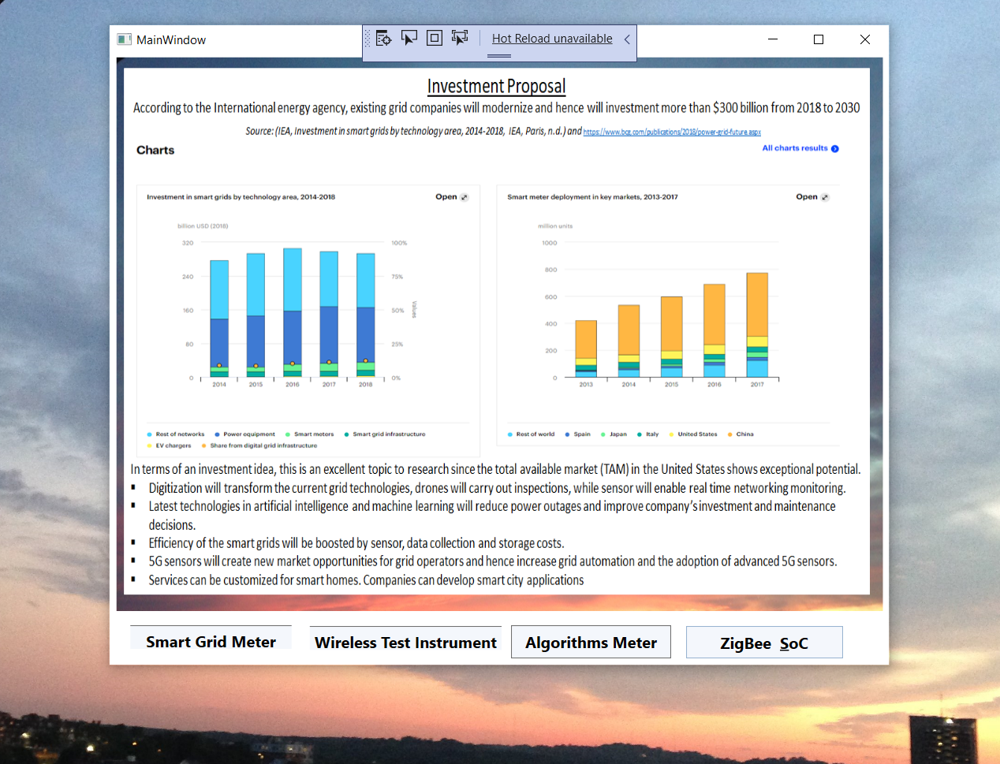
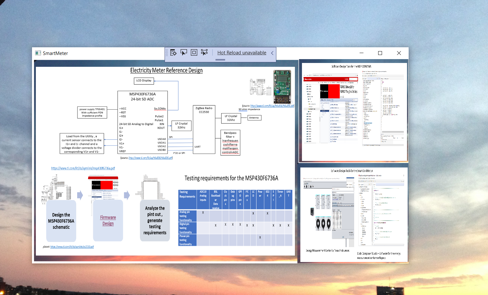
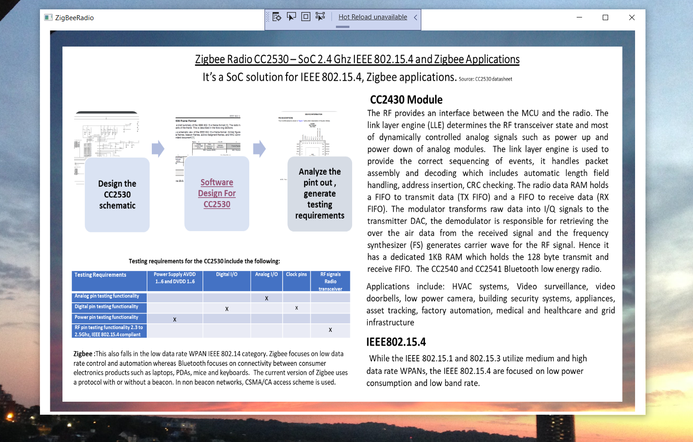
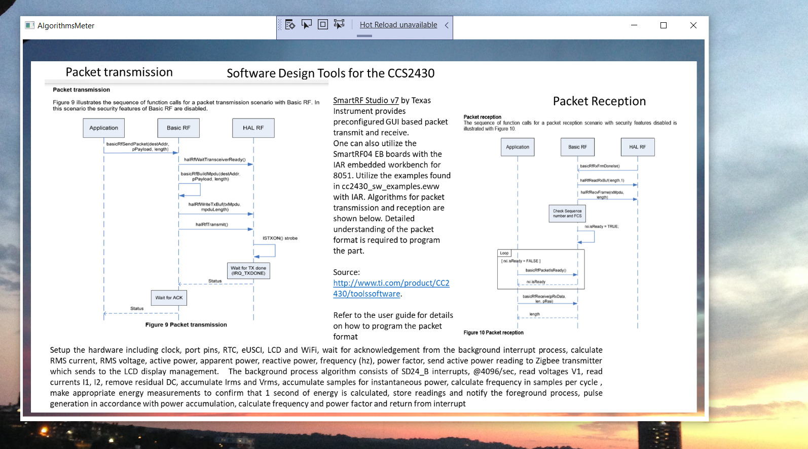
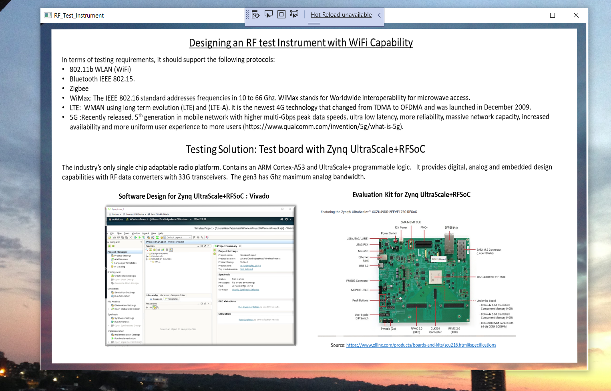

# Smart Grid Design Idea

The project provides an overview of Smart Grid Technology. 

To view the content please click on the release executable from : https://github.com/alpaddesai/SmartGridDesignIdea/releases.
Company confidential information is not displayed. All images are either custom by Alpa D Desai or a reference name is included.Most of the images are custom.

## Investment Proposal

## Smart Meter Design

## Zigbee Radio

## Software Design 

## Wireless RF Instrument

## Business Development 
https://github.com/alpaddesai/PowerandInfluentialSkills and https://github.com/alpaddesai/ProductMarketing

## New Product Development Processes
https://github.com/alpaddesai/NewProductDevelopmentProcesses 

## Architectural Design Concepts
https://github.com/alpaddesai/EmbeddedSystemsArchitecture and https://github.com/alpaddesai/HardwareEngineeringLab4-  

## Technical Expertise
Click on the following link for details: https://github.com/alpaddesai/WirelessandMobileSystems, https://github.com/alpaddesai/WirelessNetworkingProducts, https://github.com/alpaddesai/Microwave-Engineering, https://github.com/alpaddesai/Custom_ChipDesign_ASICs_Firmware_SoC and https://github.com/alpaddesai/PCBDesignProcess

## Graduate Degree Master of Science in Electrical Engineering (MSEE)

https://github.com/alpaddesai/PowerandInfluentialSkills
